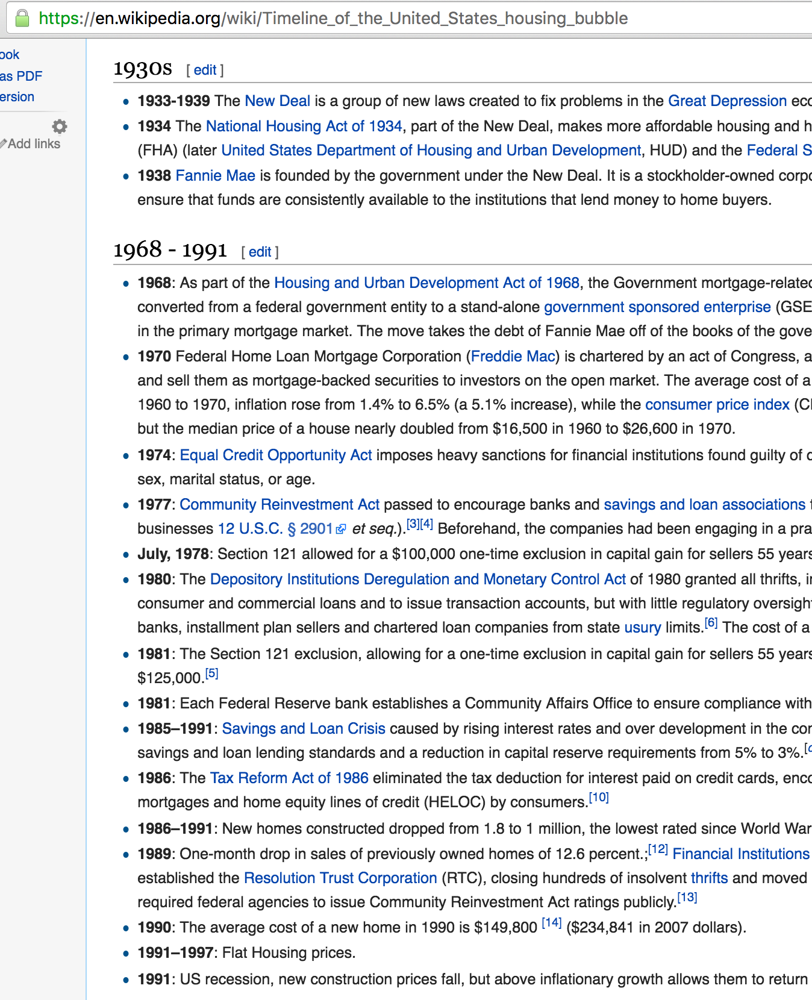
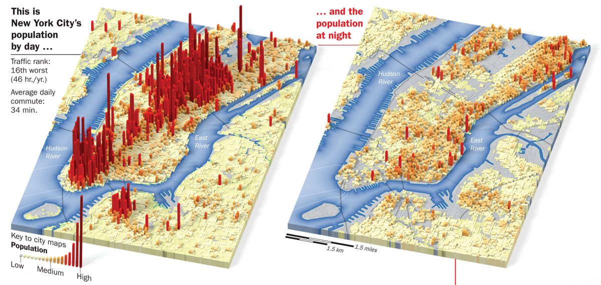

# What happened after the 2008 US housing bubble? (a casestudy of Manhattan in 2009).

Stories about the 2008 Financial Crisis often mention which banks and companies that became bankrupt and people who lost jobs and homes. However, little is mentioned of what profits were made after,just after. This analysis explores a data set that contains 18673 houses sold in Manhattan between January 2009 to December 2009. The dataset is available at  [NYC Website](www1.nyc.gov/assets/finance/downloads/.../2009_manhattan.xls)

## 1.DATA LOADING & CLEANING

#### (i) Loading required packages/libraries
```{r,warning=FALSE,message=FALSE}
# Set working dir and input data
setwd("/Users/ntabgoba/Desktop/manhatta")
library(readr)
library(ggplot2)
library(dplyr)
library(caret)
library(doMC)
library(knitr)
mhattan <- read.csv("2009_manhattan.csv",header = TRUE, skip = 4)
dim(mhattan)
head(mhattan,2)
mhattan <- as_data_frame(mhattan)
```

#### (ii) Data clearning and wrangling/munging
```{r}
# Select columns relevant to analysis
mhatta <- select(mhattan, NEIGHBORHOOD, TAX.CLASS.AT.PRESENT, BLOCK, BUILDING.CLASS.AT.PRESENT, ZIP.CODE,
                 RESIDENTIAL.UNITS, COMMERCIAL.UNITS, TOTAL.UNITS, LAND.SQUARE.FEET, GROSS.SQUARE.FEET, 
                 YEAR.BUILT, TAX.CLASS.AT.TIME.OF.SALE, BUILDING.CLASS.AT.TIME.OF.SALE, SALE.PRICE, SALE.DATE)
```

```{r}
# Rename the columns
mhatt <- rename(mhatta, neighbd = NEIGHBORHOOD, tclass_present = TAX.CLASS.AT.PRESENT, block = BLOCK , 
                  bclass_present = BUILDING.CLASS.AT.PRESENT,  zip = ZIP.CODE, res_units = RESIDENTIAL.UNITS,
                  com_units = COMMERCIAL.UNITS ,total_units = TOTAL.UNITS, land_ft = LAND.SQUARE.FEET, 
                  gross_ft = GROSS.SQUARE.FEET, year_built = YEAR.BUILT, tclass_sale = TAX.CLASS.AT.TIME.OF.SALE, 
                  bclass_sale = BUILDING.CLASS.AT.TIME.OF.SALE ,sale_price = SALE.PRICE ,sale_date = SALE.DATE)
```

        * After selecting the variables that are relevant to the analysis. We proceed to rename columns to shorter and easily programmeable wording.
        * We also change data types of price to numbers, tax to factors and date to date. R had previously automatically read price,tax and date as characters/strings.
        * We also add new variables that are a function of existing variables.

```{r}
# change column data types to their actual types
mhat <- transmute(mhatt,
                  neighbd,
                  tclass_present,
                  block,
                  bclass_present,
                  zip,
                  res_units,
                  com_units,
                  total_units,
                  land_ft = parse_number(mhatt$land_ft),
                  gross_ft = parse_number(mhatt$gross_ft),
                  year_built,
                  tclass_sale = parse_factor(mhatt$tclass_sale,levels = c(1,2,3,4)),
                  bclass_sale,
                  sale_price = parse_number(mhatt$sale_price),
                  sale_date = parse_date(mhatt$sale_date, "%m/%d/%y")
)
```


## EXPLORATORY.
```{r}
max(mhat$year_built)
min(mhat$year_built)
```

#### Age and neighborhood of most sold houses
```{r,warning=FALSE,message=FALSE, fig.width=13,fig.height=8}
ggplot(data = mhat) +
        geom_bar( mapping = aes(x = year_built,fill = neighbd,size=5,na.rm = TRUE)) +
        coord_cartesian(xlim = c(1900,2011)) +
        ggtitle("Age and Neighborhood of sold houses")
```
Interestingly from the above graph 1, we see;
        - Houses built around 2007 were sold 3 times more than any other houses built in different periods.
        - Most of all other peaks of sales are also houses that were built during years that appear on the previous US Housing bubble timeline. Interesting this could draw us to conclude that the 2008 crisis, was also partly due to an aggregated aftershocks of speculated houses that were built due to incentives rather than pure demand and supply as depicted in below timeline.
```{r, out.width = 400, fig.retina = NULL}

```
        
#### Commercial vs Residential 
We investigate to see if as more residential(_expenditure_) houses increased, did commercial houses(_production_) increase in commensurate.
```{r,warning=FALSE,message=FALSE, fig.width=13,fig.height=8}
mha <- mhat  %>%
        filter(res_units >= 1 & res_units < 150,com_units >=1) 
ggplot(data = mha, mapping = aes(x = res_units, y = com_units, color = tclass_sale),na.rm = TRUE) +
        geom_point(position = "jitter") +
        geom_smooth(se = TRUE, color = "yellow") +
        ggtitle("Commercial compared to Residential units, per Tax Class at Sale") +
        facet_wrap(~neighbd)
```

>       From graph 2 above, we realise that;
        - More and more residential houses were built, while very few commercial houses were built.
        - Apartments and Condomiums that have more than 3 units were mainly built. Tax Class of sale 2 in green colour.
        - Upper East Side and West, Chelsea, East Village, Harlem-Central and Little Italy saw most of the sales. 
Interestingly the above layout has a relationship to this map of Manhattan's population during day & night.

#### Relationship between price and gross area
```{r,warning=FALSE,message=FALSE, fig.width=13,fig.height=8}
# Filter out a $1.76Billion unit and freely offered apartments
max(mhat$sale_price)
mha <- mhat  %>%
        filter(sale_price >= 1000 & sale_price < 1000000000, gross_ft >=10) 
ggplot(data = mha) +
        geom_point(mapping = aes(x = gross_ft/100,y = sale_price/1000,color = neighbd, position = "jitter", na.rm = TRUE))+
        ggtitle("Sale Price of house versus Gross Square Foot of house") +
        coord_cartesian(xlim = c(100,3000), ylim = c(100, 150000)) # Cut out over $100M units
```

> Due to too much information in the plot, there is less we can discover from above graph 3.

#### Relation of sales and period
```{r,warning=FALSE,message=FALSE, fig.width=7,fig.height=5}
monthly <- mha %>%
        group_by(sale_date) %>%
        summarise(n = n())
ggplot(monthly, aes(sale_date, n))+
        geom_line()
```
From above graph 4, 
        - We discover that volume of house sales, varies weekly due to weekends (may be).
        - We also realise that there was an upward increase in the volume of sales from Jan 2009 towards peak in Jan 2010.
*NB:* Above graphs are simply exploratory analysis which helps us understand the data we are dealing with.

## MODEL APPLICATION
Model application is a process of trying to quantify the relationship between a variable of interest (predicted) versus other variable(s) known as predictors.
#### Features to look at Sale_Price, Gross_ft, sale_date, year_built, neighbd, res_units
```{r}
mha_model <- select(mha,neighbd,res_units, year_built, sale_price, gross_ft, sale_date)%>%
        filter(res_units >= 1, gross_ft >= 1)%>%
        mutate(price_per_resUnit = sale_price/res_units,
                  sqFt_per_resUnit = gross_ft/res_units)
```

#### Split into trainig and test data sets
```{r}
class(mha_model)
mha_mod <- as.data.frame(mha_model)
class(mha_mod)
inTrain <- createDataPartition(y=mha_mod$price_per_resUnit, p=0.7, list = FALSE)
training <- mha_mod[inTrain,]
testing <- mha_mod[-inTrain,]
rbind("original data" = dim(mha_mod), "training data" = dim(training), "testing data" = dim(testing))
```
Above is the original data split into training and testing datasets.

```{r}
# From exploratory analysis, year and total square foot of a unit are correlated to the price of a unit.
cor(training$price_per_resUnit, training$sqFt_per_resUnit, use = "na")
cor(training$price_per_resUnit,training$year_built, use = "na")
```
>       Price of a unit and Gross sqaure foot of a unit is highly correlated (0.7) and less correlated (0.0047) with the year which a unit was built.
We use both year built and gross square foot to predict the price of unit house.

#### Univariate linear regression
```{r}
fit1 <- lm(training$price_per_resUnit ~ training$sqFt_per_resUnit)
summary(fit1)
```

```{r,warning=FALSE,message=FALSE,fig.width=2, fig.height=3,echo=FALSE}
plot(fit1)
```

#### Multivariate linear regression
```{r, fig.align="center"}
fit11 <- lm(price_per_resUnit ~ sqFt_per_resUnit + year_built, data = training)
summary(fit11)
```

```{r,warning=FALSE,message=FALSE,fig.width=2, fig.height=3,echo=FALSE,out.extra='style="float:left"'}
plot(fit11)
```
#### Random Forest

To be continued.....

END.

